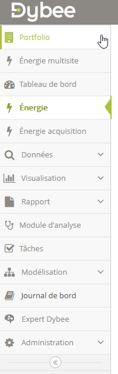

# Platform Navigation

## Interface Layout

The Dybee interface has two main navigation areas:

- **Left sidebar** — main module navigation

  

- **Top-right menu** — user account, building selection, settings

  

## Main Modules

| Module | Description |
|---|---|
| Portfolio | Multi-building overview and comparison |
| Dashboard | Configurable widget-based monitoring pages |
| Energy Monitoring | Invoice management, baseline modeling, savings tracking |
| Explorer | Real-time and historical data browsing |
| Visualization | Chart creation and management |
| Reports | Automated reporting |
| Analysis | Fault detection, rules, KPIs, and query tool |
| Tasks | Optimization measure tracking |
| Modeling | Entity management — Entities, Families, Comments, Logbook |
| Administration | Building config, users, data acquisition |

## Access Levels

Module visibility and edit permissions are controlled by user roles. Some modules (Modeling, Administration, Data Acquisition) are restricted to users with elevated permissions. See [Users & Permissions](../building-setup/users.md).
