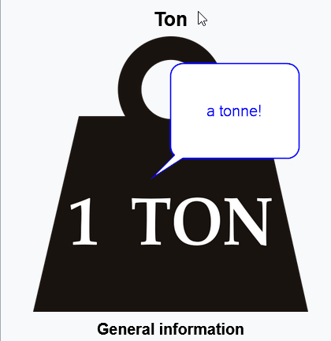

# Dybee Documentation

Dybee is a cloud-based platform for building energy management and continuous commissioning. It combines energy monitoring, digital twin modeling, real-time data acquisition, and automated fault detection in a single environment.

## Quick Navigation

| I want to… | Go to |
|---|---|
| Get started with a new building | [Building Setup](building-setup/configuration.md) |
| Understand core concepts | [Key Concepts](getting-started/concepts.md) |
| Set up energy monitoring | [Energy Sources](energy-monitoring/sources.md) |
| Model building systems | [Building Modeling](modeling/index.md) |
| Write a formula | [Functions Reference](formulas/functions.md) |
| Review detected faults | [Fault Detection](fault-detection/index.md) |
| Build a dashboard | [Dashboard Structure](dashboards/index.md) |
